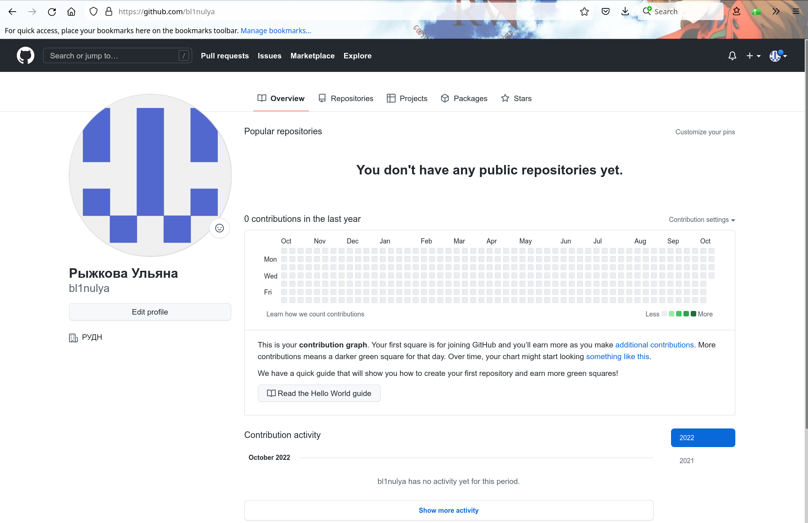
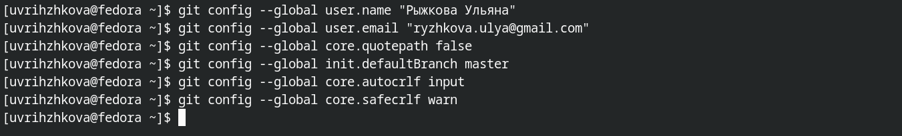
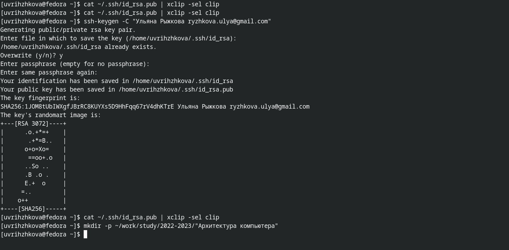
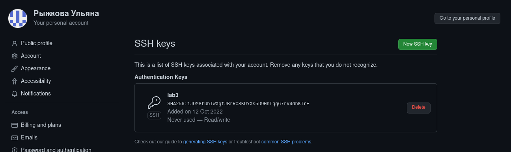
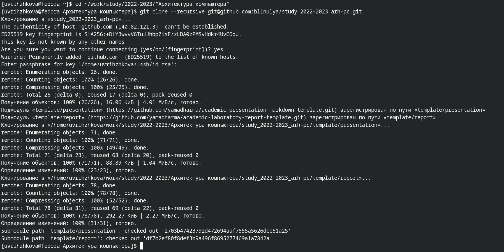
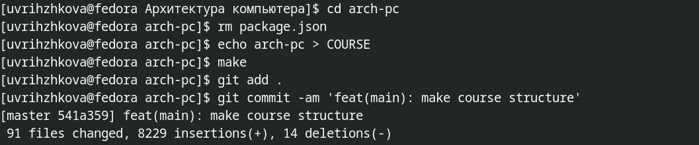
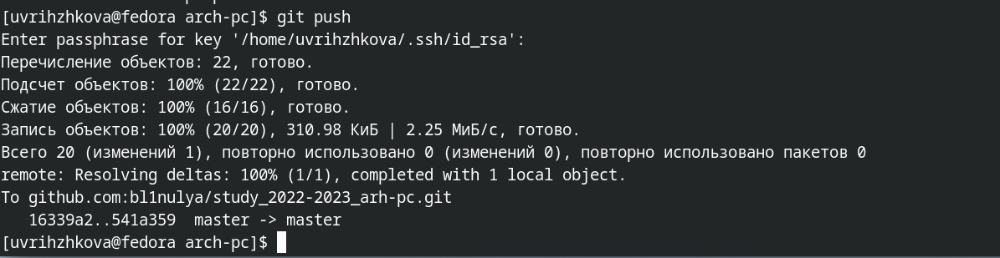
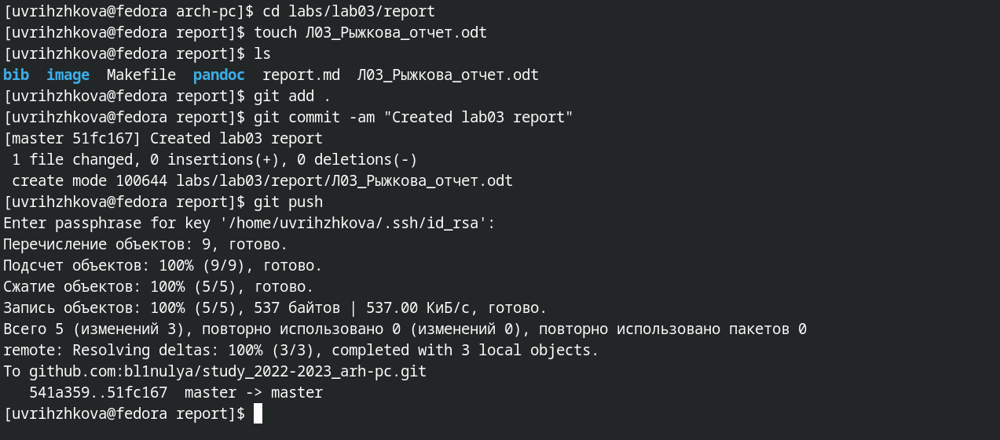
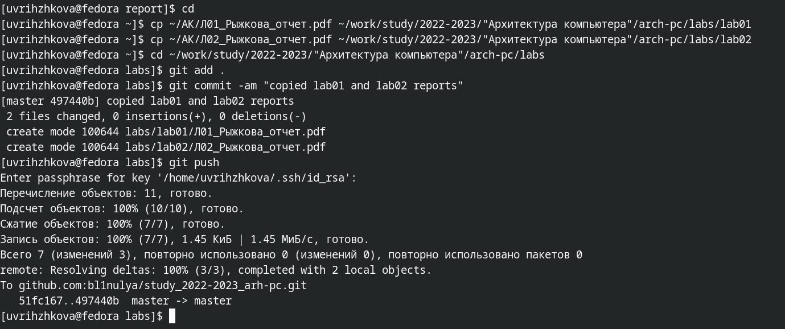

---
## Front matter
title: "Отчёт по лабораторной работе №03"
subtitle: "дисциплина: Архитектура компьютера"
author: "Студент: Рыжкова Ульяна Валерьевна, группа: НММбд-02-22"

## Generic otions
lang: ru-RU
toc-title: "Содержание"

## Bibliography
bibliography: bib/cite.bib
csl: pandoc/csl/gost-r-7-0-5-2008-numeric.csl

## Pdf output format
toc: true # Table of contents
toc-depth: 2
lof: false # List of figures
lot: false # List of tables
fontsize: 12pt
linestretch: 1.5
papersize: a4
documentclass: scrreprt
## I18n polyglossia
polyglossia-lang:
  name: russian
  options:
	- spelling=modern
	- babelshorthands=true
polyglossia-otherlangs:
  name: english
## I18n babel
babel-lang: russian
babel-otherlangs: english
## Fonts
mainfont: PT Serif
romanfont: PT Serif
sansfont: PT Sans
monofont: PT Mono
mainfontoptions: Ligatures=TeX
romanfontoptions: Ligatures=TeX
sansfontoptions: Ligatures=TeX,Scale=MatchLowercase
monofontoptions: Scale=MatchLowercase,Scale=0.9
## Biblatex
biblatex: true
biblio-style: "gost-numeric"
biblatexoptions:
  - parentracker=true
  - backend=biber
  - hyperref=auto
  - language=auto
  - autolang=other*
  - citestyle=gost-numeric
## Pandoc-crossref LaTeX customization
figureTitle: "Рис."
tableTitle: "Таблица"
listingTitle: "Листинг"
lofTitle: "Список иллюстраций"
lotTitle: "Список таблиц"
lolTitle: "Листинги"
## Misc options
indent: true
header-includes:
  - \usepackage{indentfirst}
  - \usepackage{float} # keep figures where there are in the text
  - \floatplacement{figure}{H} # keep figures where there are in the text
---

# Цель работы

Изучить идеологию и применения средств контроля версий, приобрести практические навыки по работе с системой git.

# Выполнение лабораторной работы

1. У меня уже существует учетная запись на сайте github.com, поэтому я не создавала новую.

{ #fig:001 width=100% }

2. Провожу предварительную конфигурацию git:

{ #fig:002 width=100% }

3. Генерирую ключи и создаю каталог для предмета “Архитектура компьютера”:

{ #fig:003 width=100% }

{ #fig:004 width=100% }

4. Клонирую созданный по шаблону репозиторий:

{ #fig:005 width=100% }

5. Перехожу в каталог курса, удаляю лишние файлы, создаю необходимые каталоги и отправляю файлы на сервер:

{ #fig:006 width=100% }

{ #fig:007 width=100% }

# Самостоятельная работа

1. Создаю отчёт по выполнению лабораторной работы в соответсвующем каталоге:

{ #fig:008 width=70% }

2. Копирую прошлые отчёты и загружаю их на github:

{ #fig:009 width=70% }

# Выводы

В ходе лабораторной работы я познакомилась с системой git и её основным функционалом.

