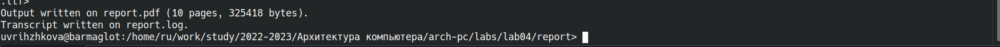

---
## Front matter
title: "Отчёт по лабораторной работе №04"
subtitle: "Дисциплина: Архитектура компьютера"
author: "Студент: Рыжкова Ульяна Валерьевна, группа: НММбд-02-22"

## Generic otions
lang: ru-RU
toc-title: "Содержание"

## Bibliography
bibliography: bib/cite.bib
csl: pandoc/csl/gost-r-7-0-5-2008-numeric.csl

## Pdf output format
toc: false # Table of contents
toc-depth: 2
lof: false # List of figures
lot: false # List of tables
fontsize: 12pt
linestretch: 1.5
papersize: a4
documentclass: scrreprt
## I18n polyglossia
polyglossia-lang:
  name: russian
  options:
	- spelling=modern
	- babelshorthands=true
polyglossia-otherlangs:
  name: english
## I18n babel
babel-lang: russian
babel-otherlangs: english
## Fonts
mainfont: PT Serif
romanfont: PT Serif
sansfont: PT Sans
monofont: PT Mono
mainfontoptions: Ligatures=TeX
romanfontoptions: Ligatures=TeX
sansfontoptions: Ligatures=TeX,Scale=MatchLowercase
monofontoptions: Scale=MatchLowercase,Scale=0.9
## Biblatex
biblatex: true
biblio-style: "gost-numeric"
biblatexoptions:
  - parentracker=true
  - backend=biber
  - hyperref=auto
  - language=auto
  - autolang=other*
  - citestyle=gost-numeric
## Pandoc-crossref LaTeX customization
figureTitle: "Рис."
tableTitle: "Таблица"
listingTitle: "Листинг"
lofTitle: "Список иллюстраций"
lotTitle: "Список таблиц"
lolTitle: "Листинги"
## Misc options
indent: true
header-includes:
  - \usepackage{indentfirst}
  - \usepackage{float} # keep figures where there are in the text
  - \floatplacement{figure}{H} # keep figures where there are in the text
---

# Цель работы

Целью данной работы является освоение процедуры оформления отчетов с помощью легковесного языка разметки Markdown.

# Выполнение лабораторной работы

1. Предварительно я установила TeXLive, Pandoc и Pandoc-crossref. Зайдя в каталог курса, обновила локальный репозиторий и перешла в каталог по лабораторной №4:

{ #fig:001 width=100% }

2. При компиляции шаблона возник ряд проблем, основной из которых являлась package babel error: bad option `bidi=basic'", из-за чего pdf-файл не создавался. Путём проб и ошибок был придуман успешный способ компиляции шаблона: 

{ #fig:002 width=100% }

изменив Makefile так, что промежуточный tex-файл теперь сохраняется в текущий каталог, и заменяя в полученном tex-файле проблемную строку, при прямом вызове lualatex получаем нужный pdf-файл: 

{ #fig:003 width=100% }

Единственный нюанс - нужно почистить все сторонние файлы, появляющиеся при создании tex-файла:

{ #fig:004 width=100% }

3. Удаляю полученные при использовании Makefile файлы с помощью команд make clean и rm:

{ #fig:005 width=100% }

# Самостоятельная работа

1. Я отредактировала файлы report.md и Makefile в каталоге предыдущей лабораторной работы и создала отчёт с помощью шаблона:

{ #fig:006 width=100% }

2. Загружаю изменения на github:

{ #fig:007 width=100% }

# Выводы

Я ознакомилась с базовым функционалом языка разметки Markdown.

