---
## Front matter
title: "Отчёт по лабораторной работе №6"
subtitle: "Дисциплина: Архитектура компьютера"
author: "Рыжкова Ульяна Валерьевна"

## Generic otions
lang: ru-RU
toc-title: "Содержание"

## Bibliography
bibliography: bib/cite.bib
csl: pandoc/csl/gost-r-7-0-5-2008-numeric.csl

## Pdf output format
toc: true # Table of contents
toc-depth: 2
lof: true # List of figures
lot: true # List of tables
fontsize: 12pt
linestretch: 1.5
papersize: a4
documentclass: scrreprt
## I18n polyglossia
polyglossia-lang:
  name: russian
  options:
	- spelling=modern
	- babelshorthands=true
polyglossia-otherlangs:
  name: english
## I18n babel
babel-lang: russian
babel-otherlangs: english
## Fonts
mainfont: PT Serif
romanfont: PT Serif
sansfont: PT Sans
monofont: PT Mono
mainfontoptions: Ligatures=TeX
romanfontoptions: Ligatures=TeX
sansfontoptions: Ligatures=TeX,Scale=MatchLowercase
monofontoptions: Scale=MatchLowercase,Scale=0.9
## Biblatex
biblatex: true
biblio-style: "gost-numeric"
biblatexoptions:
  - parentracker=true
  - backend=biber
  - hyperref=auto
  - language=auto
  - autolang=other*
  - citestyle=gost-numeric
## Pandoc-crossref LaTeX customization
figureTitle: "Рис."
tableTitle: "Таблица"
listingTitle: "Листинг"
lofTitle: "Список иллюстраций"
lotTitle: "Список таблиц"
lolTitle: "Листинги"
## Misc options
indent: true
header-includes:
  - \usepackage{indentfirst}
  - \usepackage{float} # keep figures where there are in the text
  - \floatplacement{figure}{H} # keep figures where there are in the text
---

# Цель работы

Целью работы является освоение основного функционала Midnight Commander и инструкций языка ассемблера mov и int.

# Выполнение лабораторной работы

1. Открываю Midnight Commander с помощью команды mc, после чего перехожу в нужный каталог

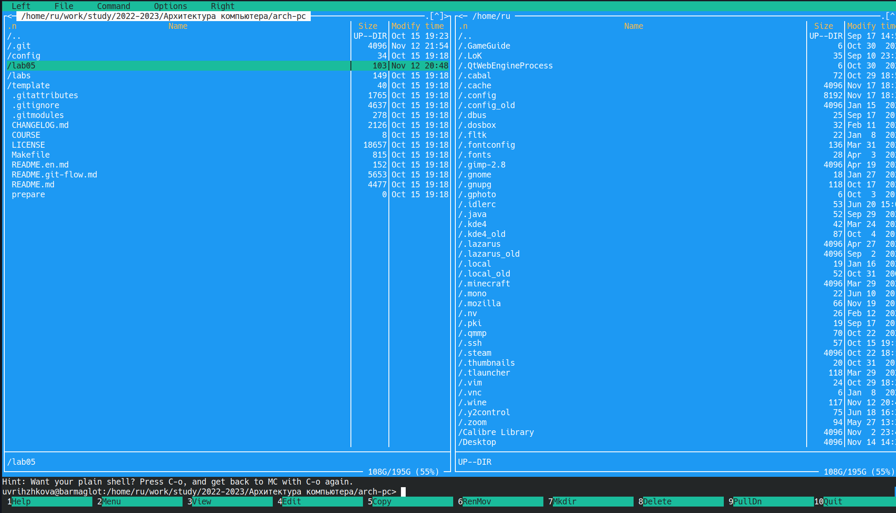{ #fig:001 width=100% }

2. С помощью клавиши F7 создаю папку lab06, в которой создаю файл 6-1.asm с помощью команды touch

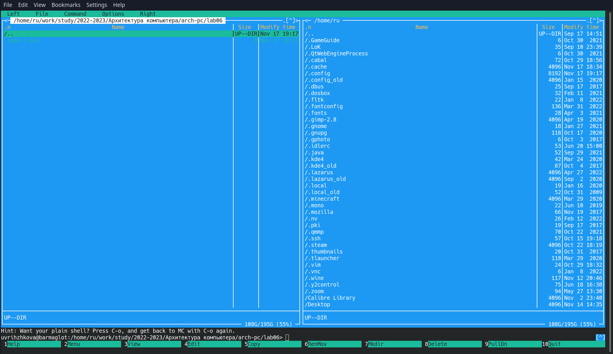{ #fig:002 width=100% }

3. После ввода программы из листинга 6.1, транслирую текст программы в объектный файл, выполняю компоновку и запускаю получечнный файл.

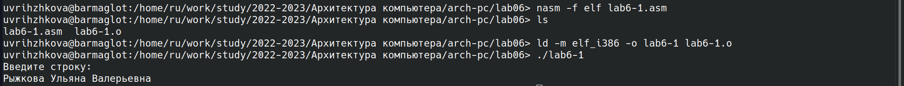{ #fig:003 width=100% }

4. С помощью команды mv перемещаю файл in_out.asm (Сначала переместила, только потом увидела, что это нужно было сделать в mc)

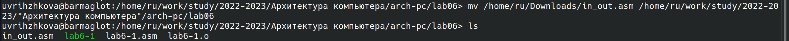{ #fig:004 width=100% }

5. С помощью функциональной клавиши F6 создаю копию lab6-1.asm с именем lab6-2.asm

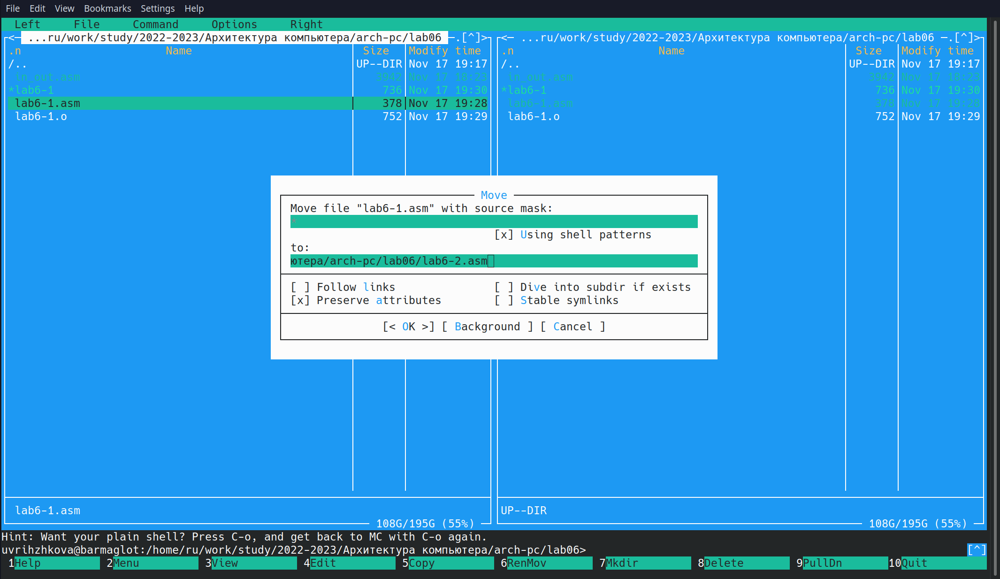{ #fig:005 width=100% }

6. Исправив текст программы и создав исполняемый файл, проверяю его работу

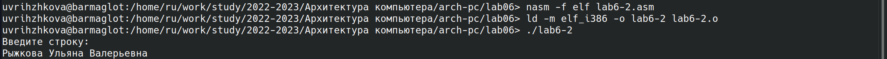{ #fig:006 width=100% }

7. Заменяю подпрограмму sprintLF на sprint и проверяю работу модифицированного файла. Разница между подпрограммами заключается в отсутствии переноса строки после приглашения ввести строку

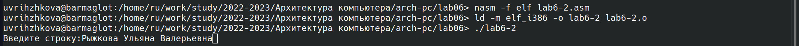{ #fig:007 width=100% }

# Выполнение самостоятельной работы

1. В копии файла lab6-1.asm добавляю вывод введённой строки (на рисунке добавленный код выделен зелёным)

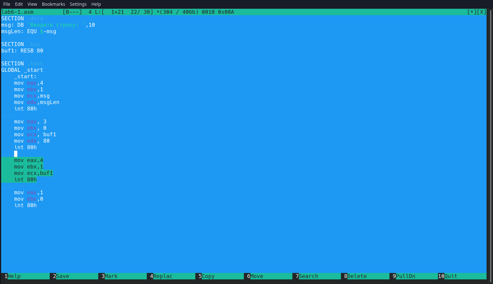{ #fig:008 width=100% }

2. Создаю исполняемый файл и проверяю корректность работы программы

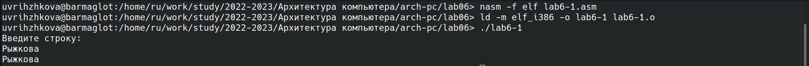{ #fig:009 width=100% }

3. В копии файла lab6-2.asm добавляю вывод введённой строки (на рисунке добавленный код выделен зелёным)

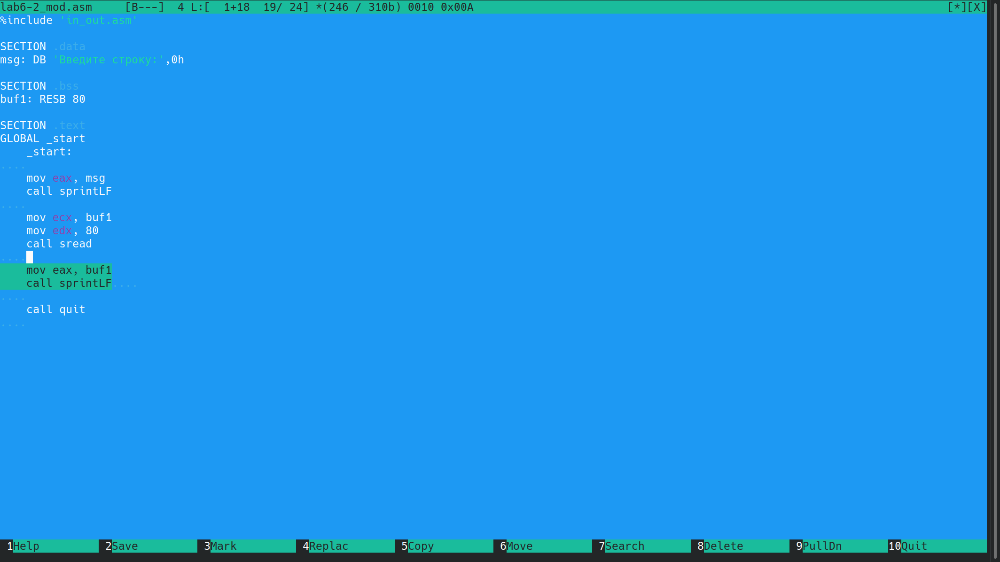{ #fig:010 width=100% }

4. Создаю исполняемый файл и проверяю корректность работы программы

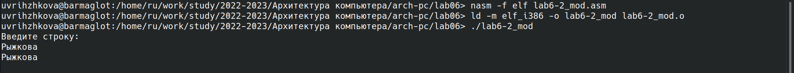{ #fig:011 width=100% }

5. Загружаю все файлы на github

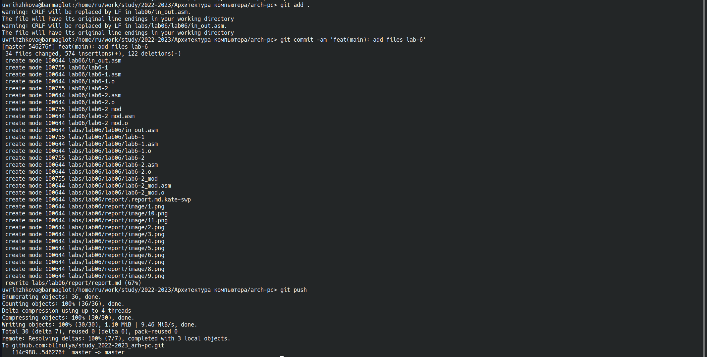{ #fig:012 width=100% }

# Выводы

Я ознакомилась с работой в Midnight Commander и освоила инструкции языка ассемблера mov и int.
