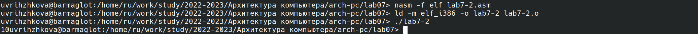
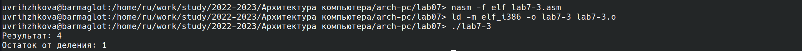
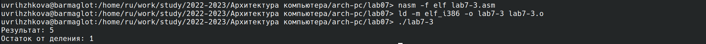

---
## Front matter
title: "Отчёт по лабораторной работе №7"
subtitle: "Дисциплина: Архитектура компьютера"
author: "Рыжкова Ульяна Валерьевна"

## Generic otions
lang: ru-RU
toc-title: "Содержание"

## Bibliography
bibliography: bib/cite.bib
csl: pandoc/csl/gost-r-7-0-5-2008-numeric.csl

## Pdf output format
toc: true # Table of contents
toc-depth: 2
lof: true # List of figures
lot: true # List of tables
fontsize: 12pt
linestretch: 1.5
papersize: a4
documentclass: scrreprt
## I18n polyglossia
polyglossia-lang:
  name: russian
  options:
	- spelling=modern
	- babelshorthands=true
polyglossia-otherlangs:
  name: english
## I18n babel
babel-lang: russian
babel-otherlangs: english
## Fonts
mainfont: PT Serif
romanfont: PT Serif
sansfont: PT Sans
monofont: PT Mono
mainfontoptions: Ligatures=TeX
romanfontoptions: Ligatures=TeX
sansfontoptions: Ligatures=TeX,Scale=MatchLowercase
monofontoptions: Scale=MatchLowercase,Scale=0.9
## Biblatex
biblatex: true
biblio-style: "gost-numeric"
biblatexoptions:
  - parentracker=true
  - backend=biber
  - hyperref=auto
  - language=auto
  - autolang=other*
  - citestyle=gost-numeric
## Pandoc-crossref LaTeX customization
figureTitle: "Рис."
tableTitle: "Таблица"
listingTitle: "Листинг"
lofTitle: "Список иллюстраций"
lotTitle: "Список таблиц"
lolTitle: "Листинги"
## Misc options
indent: true
header-includes:
  - \usepackage{indentfirst}
  - \usepackage{float} # keep figures where there are in the text
  - \floatplacement{figure}{H} # keep figures where there are in the text
---

# Цель работы

Освоение арифметических инструкций языка ассемблера NASM.

# Выполнение лабораторной работы

1. Создаю каталог lab07 и необходимые для дальнейшей работы файлы.

{ #fig:001 width=100% }

2. Переписываю программу из листинга 7.1, создаю исполняемый файл и запускаю его.

{ #fig:002 width=100% }

3. Результат работы изменённой программы:

{ #fig:003 width=100% }

4. Переписываю программу из листинга 7.2, создаю исполняемый файл и запускаю его.

{ #fig:004 width=100% }

5. Результат работы изменённой программы:

{ #fig:005 width=100% }

6. При замене функции iprintLF на iprint видно, что функция iprintLF выводит значение на экран, после чего выполняется перенос строки, в то время как после вывода с помощью iprint перенос не выполняется:

{ #fig:006 width=100% }

7. Результат работы программы из листинга 7.3:

{ #fig:007 width=100% }

8. Программа, вычисляющая f(x) = (4 * 6 + 2) / 5, и результат её работы:

{ #fig:008 width=100% }

{ #fig:009 width=100% }

9. Вычисляю номер варианта:

{ #fig:010 width=100% }

# Ответы на вопросы

1. За вывод предложение ввести номер студенческого билета отвечают строки mov eax, msg и call sprintLF

2. Данные инструкции используются для ввода переменной х с клавиатуры и сохранения введенных данных

3. Данная инструкция используется для преобразования ASCII кода в число

4. За вычисление варианта отвечают строки xor edx,edx; mov ebx,20; div ebx; inc edx.

5. Остаток от деления при выполнении инструкции 'div ebx' записывает в регистр ebx

6. Данная инструкция используется для того, чтобы увеличить значение edx на единицу

7. За вывод результата вычисления отвечают строки mov eax,edx; call iprintLF

# Выполнение самостоятельной работы

Мой вариант - 3, я написала программу для f(x) = (x + 2)^2. Код и результат работы программы:

{ #fig:011 width=100% }

{ #fig:012 width=100% }

Программа работает корректно.

# Выводы

Я ознакомилась с арифметическими инструкциями языка ассемблера NASM.

