---
## Front matter
title: "Отчёт по лабораторной работе №8"
subtitle: "Дисциплина: Архитектура компьютера"
author: "Рыжкова Ульяна Валерьевна"

## Generic otions
lang: ru-RU
toc-title: "Содержание"

## Bibliography
bibliography: bib/cite.bib
csl: pandoc/csl/gost-r-7-0-5-2008-numeric.csl

## Pdf output format
toc: true # Table of contents
toc-depth: 2
lof: true # List of figures
lot: true # List of tables
fontsize: 12pt
linestretch: 1.5
papersize: a4
documentclass: scrreprt
## I18n polyglossia
polyglossia-lang:
  name: russian
  options:
	- spelling=modern
	- babelshorthands=true
polyglossia-otherlangs:
  name: english
## I18n babel
babel-lang: russian
babel-otherlangs: english
## Fonts
mainfont: PT Serif
romanfont: PT Serif
sansfont: PT Sans
monofont: PT Mono
mainfontoptions: Ligatures=TeX
romanfontoptions: Ligatures=TeX
sansfontoptions: Ligatures=TeX,Scale=MatchLowercase
monofontoptions: Scale=MatchLowercase,Scale=0.9
## Biblatex
biblatex: true
biblio-style: "gost-numeric"
biblatexoptions:
  - parentracker=true
  - backend=biber
  - hyperref=auto
  - language=auto
  - autolang=other*
  - citestyle=gost-numeric
## Pandoc-crossref LaTeX customization
figureTitle: "Рис."
tableTitle: "Таблица"
listingTitle: "Листинг"
lofTitle: "Список иллюстраций"
lotTitle: "Список таблиц"
lolTitle: "Листинги"
## Misc options
indent: true
header-includes:
  - \usepackage{indentfirst}
  - \usepackage{float} # keep figures where there are in the text
  - \floatplacement{figure}{H} # keep figures where there are in the text
---

# Цель работы

Изучение команд условного и безусловного переходов, приобретение навыков написания программ с переходами, знакомство с назначением и структурой файла листинга.

# Выполнение лабораторной работы

1. Создав каталог lab08 и файл lab8-1.asm, переписываю в файл программу из листинга 8.1. Создаю исполняемый файл и запускаю его:

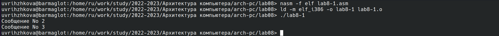{ #fig:001 width=100% }

2. Результат работы изменённого файла:

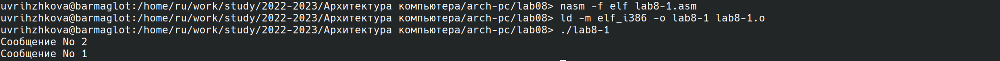{ #fig:002 width=100% }

3. Меняю программу в соответсвии с требованием к результату. Пргорамма работает корректно:

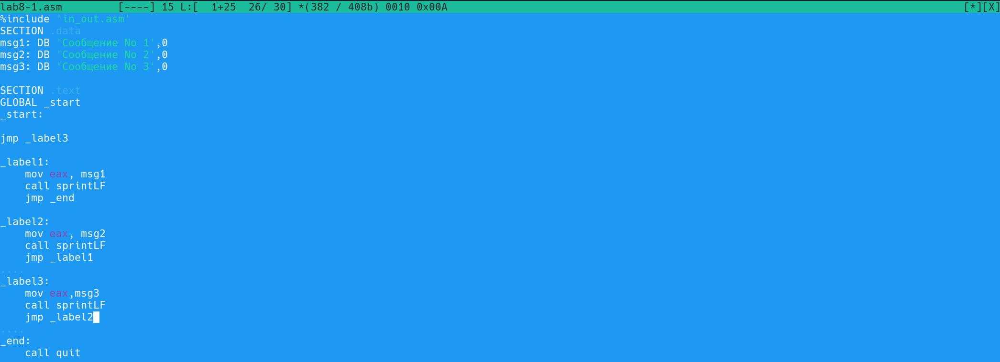{ #fig:003 width=100% }

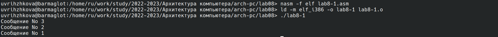{ #fig:004 width=100% }

5. Переписываю программу из листинга 8.3 в файл lab8-2.asm, создаю исполняемый файл и смотрю результат работы при различных значениях В:

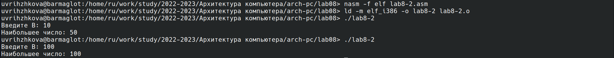{ #fig:005 width=100% }

6. Открываю полученный с помощью команды nasm -f elf -l lab8-2.lst lab8-2.asm файл листинга:

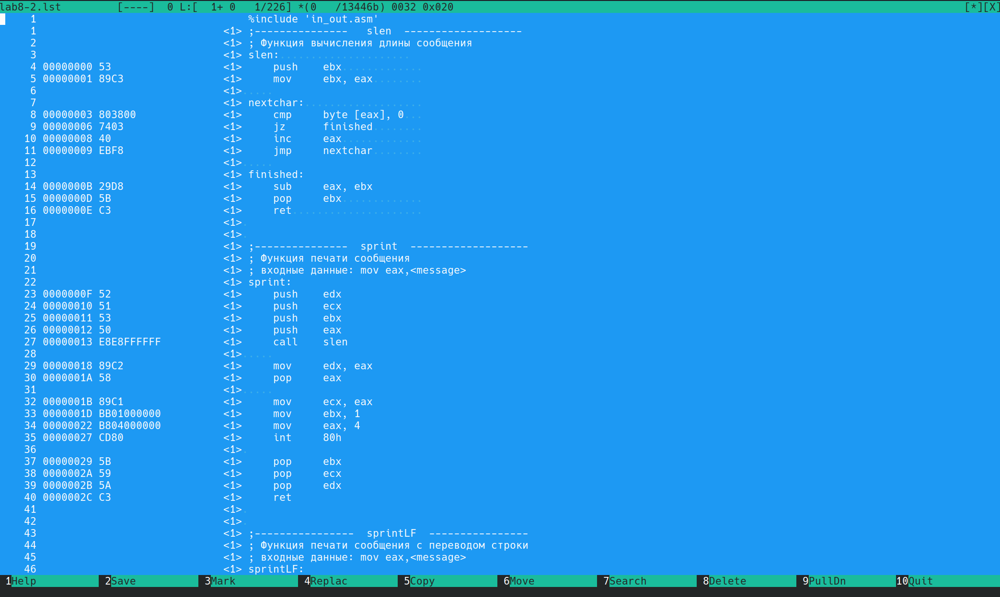{ #fig:006 width=100% }

Рассмотрим три строки:

23 строка: 00000101 (адрес) B80A000000 (машинный код) mov eax,B (в регистр еах вносим значение B)

40 строка: 00000145 (адрес) 3B0D0A000000 (машинный код) сmp ecx,B (сравниваем значение регистра есх и значение B)

21 строка: 000000FC (адрес) E842FFFFFF (машинный код) call sread (считываем сообщение)

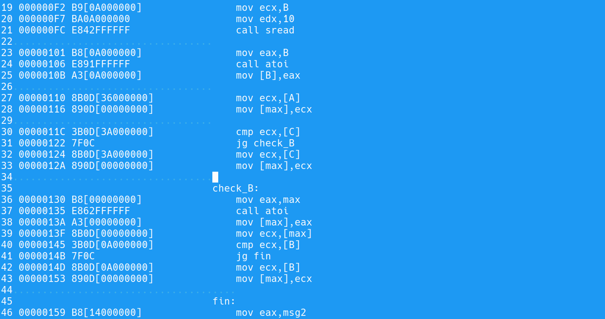{ #fig:015 width=100% }

7. В тексте программы намеренно делаю ошибку:

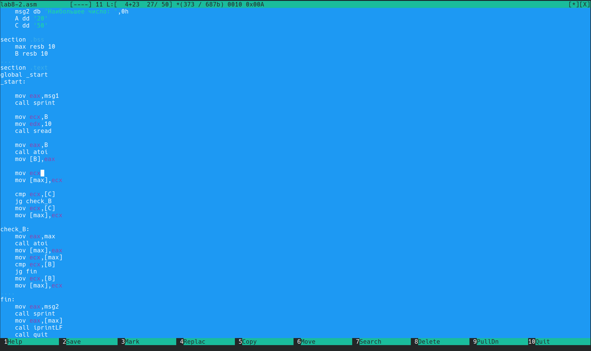{ #fig:007 width=100% }

8. Видим, что выводится ошибка:

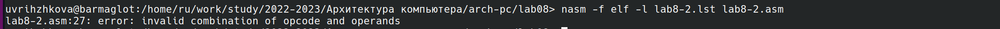{ #fig:008 width=100% }

9. Листинг ошибки:

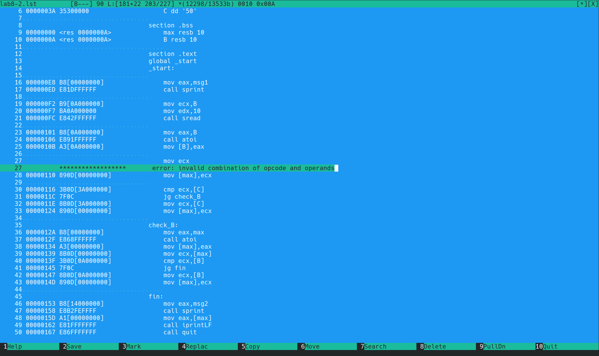{ #fig:009 width=100% }

10. При попытке создания выходных файлов ничего не получаем из-за ошибки:

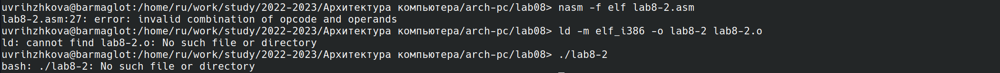{ #fig:010 width=100% }

# Выполнение самостоятельной работы

1. По номеру студенческого мой вариант - 3. Ищу наименьшее из набора чисел 94, 5, 58 используя программу:

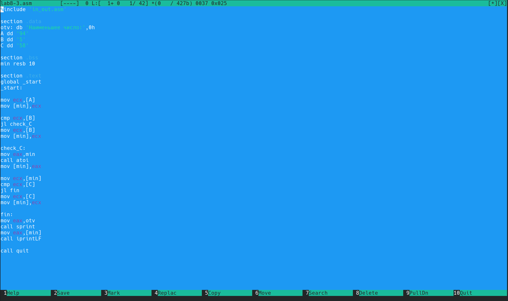{ #fig:011 width=100% }

2. Программа работает корректно:

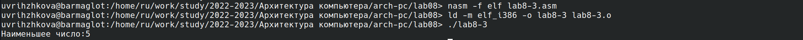{ #fig:012 width=100% }

3. Выполнение второго задания:

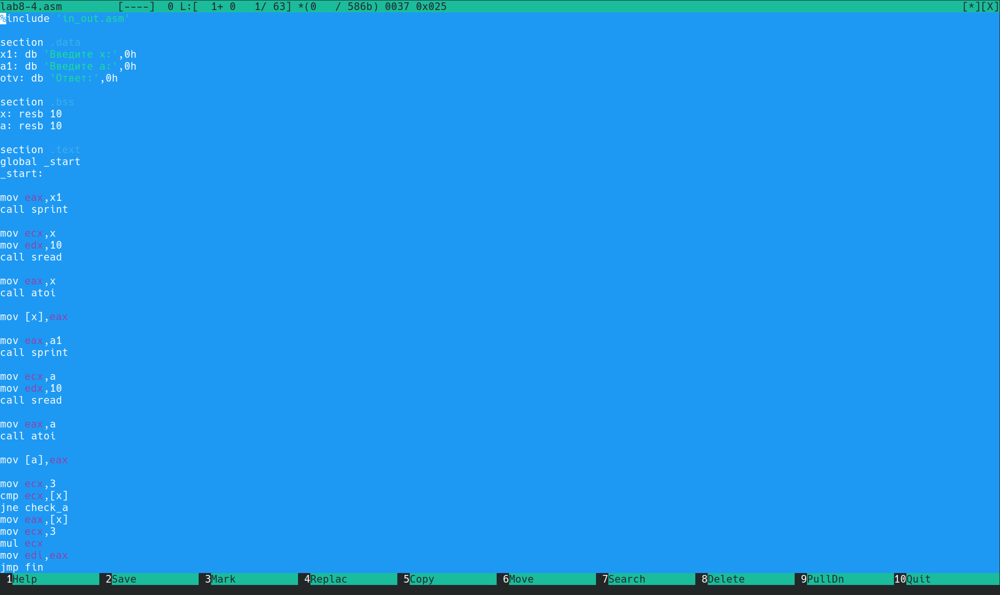{ #fig:013 width=100% }

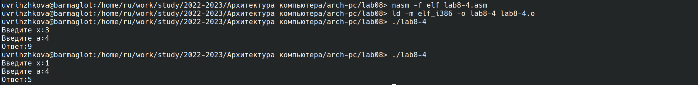{ #fig:014 width=100% }

# Выводы

Я ознакомилась с командами переходов, научилась писать программы с ними и изучила структуру файла листинга.
